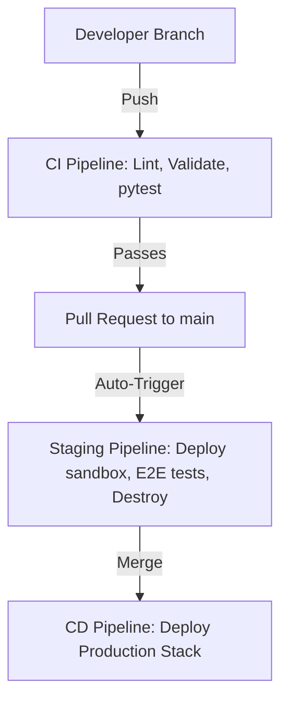

# CI/CD Overview

This document describes the Continuous Integration and Continuous Delivery (CI/CD) strategy for our Serverless AWS stack (API Gateway + S3 + Lambda) managed by Terraform.

---

## CI/CD Objectives
* **Zero Static Credentials**: Authenticate to AWS securely using OIDC.
* **Early Infrastructure Validation**: Lint and plan Terraform code before merging.
* **Automated Python Testing**: Run unit and integration tests automatically.
* **Safe Serverless Deployments**: Package Lambda handlers and deploy via Terraform.

---

## The Three Delivery Domains
Our CI/CD architecture is divided into three distinct automated domains:

1. **Infrastructure Delivery (Terraform)**
   - Manages AWS API Gateway, S3 buckets, IAM roles, and Lambda configurations.
   - Files monitored: `terraform/**`, `**.tf`.
   - Read more: [Infrastructure Delivery](./infrastructure-delivery.md)

2. **Application Delivery (Lambda Handler)**
   - Builds, tests, packages (ZIP), and updates Python Lambda handler code.
   - Files monitored: `lambda/**`.
   - Read more: [Application Delivery](./application-delivery.md)

3. **Documentation Delivery (MkDocs)**
   - Builds and publishes this documentation site to GitHub Pages.
   - Files monitored: `docs/**`, `mkdocs.yml`.

---

## Environment & Promotion Flow
We map our Git branching model to AWS deployment environments:

## Security Principles

- **OpenID Connect (OIDC)**: GitHub Actions assumes AWS IAM roles dynamically using temporary tokens. No static AWS Access Keys are stored in GitHub Secrets.
- **SSM Parameter Store**: Shared variables (e.g., bucket names, API endpoints) are queried dynamically using AWS SSM parameter paths.
- **Secret Masking**: Sensitive variables are isolated via GitHub Repository Secrets.
