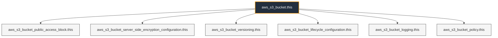

# Terraform AWS S3 Bucket Module

A flexible, production-ready Terraform module for provisioning and configuring secure Amazon S3 buckets. This module enforces security best practices by default (such as public access blocking) while offering dynamic opt-ins for versioning, encryption, lifecycle rules, access logging, and custom bucket policies.

---

## Component Overview



---

## Features

- **Core S3 Bucket Provisioning**: Custom naming and flexible resource tagging.
- **Mandatory Public Access Block**: Blocks public ACLs and bucket policies by default to prevent accidental data leaks.
- **Flexible Encryption**: Supports both AWS-managed keys (`AES256` / `SSE-S3`) and customer-managed KMS keys (`aws:kms`) via a simple toggle (`enable_kms`).
- **Versioning Control**: Easily toggle object versioning (`Enabled` or `Suspended`).
- **Lifecycle Rules**: Dynamic support for storage class transitions (e.g., Standard-IA, Glacier) and object expiration rules.
- **Server Access Logging**: Optional configuration to deliver access logs to a centralized audit/logging bucket.
- **Custom Bucket Policies**: Optional attachment of custom IAM JSON policies.

---

## Usage

Here is an example of how to call this module in your Terraform configuration:

```hcl
module "my_secure_bucket" {
  source = "./modules/s3-bucket" # Update to your module path

  bucket_name = "my-company-app-production-data"

  # Security & Versioning
  enable_versioning   = true
  enable_kms          = true
  kms_key_arn         = "arn:aws:kms:us-east-1:123456789012:key/your-kms-key-id"

  # Access Logging
  enable_access_logging = true
  access_log_bucket     = "my-company-central-audit-logs-bucket"
  access_log_prefix     = "s3/my-company-app-production-data/"

  # Lifecycle Rules (Cost Optimization)
  lifecycle_rules = [
    {
      id      = "archive-old-logs"
      enabled = true
      transition = [
        {
          days          = 30
          storage_class = "STANDARD_IA"
        },
        {
          days          = 90
          storage_class = "GLACIER"
        }
      ]
      expiration_days = 365
    }
  ]

  tags = {
    Environment = "production"
    ManagedBy   = "Terraform"
    Owner       = "DataPlatformTeam"
  }
}

```

---

## Inputs

| Name | Description | Type | Default | Required |
| --- | --- | --- | --- | --- |
| `bucket_name` | Name of the S3 bucket (must be globally unique). | `string` | n/a | **yes** |
| `tags` | Map of tags to assign to the S3 bucket. | `map(string)` | `{}` | no |
| `block_public_acls` | Set to `true` to block public ACLs for this bucket. | `bool` | `true` | no |
| `block_public_policy` | Set to `true` to block public bucket policies. | `bool` | `true` | no |
| `ignore_public_acls` | Set to `true` to ignore public ACLs. | `bool` | `true` | no |
| `restrict_public_buckets` | Set to `true` to restrict public bucket policies. | `bool` | `true` | no |
| `enable_kms` | Enable custom SSE-KMS encryption (`true`) or fallback to SSE-S3 (`false`). | `bool` | `false` | no |
| `kms_key_arn` | ARN of the KMS key to use if `enable_kms` is `true`. | `string` | `null` | no |
| `enable_versioning` | Toggle to enable (`true`) or suspend (`false`) S3 bucket versioning. | `bool` | `true` | no |
| `lifecycle_rules` | List of maps defining lifecycle rules, transitions, and expirations. | `list(any)` | `[]` | no |
| `enable_access_logging` | Enable server access logging to a target bucket. | `bool` | `false` | no |
| `access_log_bucket` | Name of the target S3 bucket for receiving access logs. | `string` | `null` | no |
| `access_log_prefix` | Prefix folder path inside the target access log bucket. | `string` | `""` | no |
| `attach_bucket_policy` | Toggle to attach a custom JSON bucket policy. | `bool` | `false` | no |
| `bucket_policy_json` | Valid IAM policy JSON string to attach to the bucket. | `string` | `null` | no |

---

## Outputs

| Name | Description |
| --- | --- |
| `bucket_id` | The name/ID of the provisioned S3 bucket. |
| `bucket_arn` | The ARN of the provisioned S3 bucket. |
| `bucket_domain_name` | The bucket domain name. |

```

```
